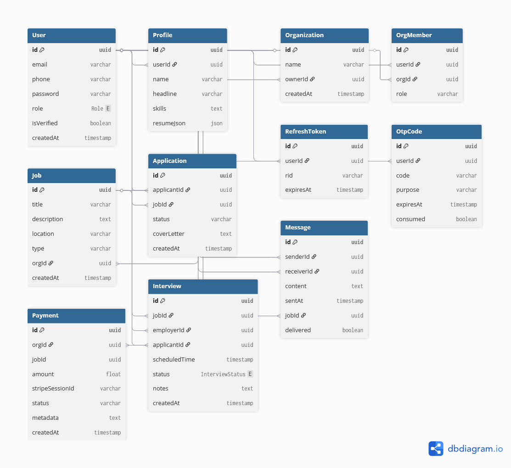

# 🧰 Job Hub – Job Seekers & Employers Platform

## 🌐 Live Link
**[https://job-hub-v5zz.onrender.com/](https://job-hub-v5zz.onrender.com/)**  
_(Please wait a minute if the Render server takes time to start.)_

## 📖 Project Overview
**Job Hub** is a full-featured, secure, and scalable two-sided marketplace connecting **job seekers (applicants)** with **employers (talent seekers)**.  
The platform streamlines the entire hiring lifecycle — from **profile creation and job discovery** to **application, communication, and payment** — while supporting advanced workflows such as **interview scheduling**, **job offers**, and **analytics**.

Key Highlights:
- Secure user authentication (JWT) with OTP verification  
- Role-based access control (Admin, Employer, Employee)  
- Resume creation and PDF export  
- Job posting (3 free posts, paid afterward via Stripe)  
- Applicant tracking and CSV export  
- Interview scheduling system  
- Real-time messaging via BullMQ + Redis  
- Admin dashboards for full system management  
- Error handling with detailed structured responses

---

## 🧠 Technology Stack
| Layer | Technology |
|-------|-------------|
| **Language** | TypeScript |
| **Framework** | Express.js |
| **ORM** | Prisma |
| **Database** | PostgreSQL |
| **Cache / Queue** | Redis (BullMQ) |
| **Authentication** | JWT + OTP (email/phone) |
| **Payments** | Stripe API (Test Mode) |
| **Containerization** | Docker & Docker Compose |
| **Documentation** | Swagger UI |
| **Deployment** | Render |
| **Validation** | Zod |
| **Error Handling** | Global middleware with structured JSON responses |

---

## 📘 API Documentation
Swagger UI:  
**[https://job-hub-v5zz.onrender.com/docs](https://job-hub-v5zz.onrender.com/docs)**

The documentation includes all major endpoints:
- `/api/auth` — Signup, OTP Verification, Login  
- `/api/admin` — User, Employer, Organization management  
- `/api/jobs` — Job CRUD & filtering  
- `/api/applications` — Apply, view, and download applicants  
- `/api/interviews` — Scheduling, cancel, reschedule  
- `/api/messages` — Real-time messaging queue  

---

## ⚙️ Manual Setup

### 1. Prerequisites
- [Docker Desktop](https://www.docker.com/)
- [Node.js](https://nodejs.org/) version ≥ 18

### 2. Clone Repository
```bash
git clone https://github.com/ariffaisal-github/Job-Hub.git
cd Job-Hub
```

### 3. Create `.env` File (in project root)
```env
DATABASE_URL="postgresql://postgres:postgres@db:5432/jobhub?schema=public"
REDIS_URL="redis://redis:6379"
JWT_SECRET=supersecret
PORT=4000
STRIPE_SECRET_KEY=sk_test_<your_test_key>
STRIPE_PUBLISHABLE_KEY=pk_test_<your_key>
STRIPE_WEBHOOK_SECRET=whsec_dummy
```

### 4. Run the App in Docker
```bash
docker compose up --build
```

This spins up:
- Express.js backend  
- PostgreSQL database  
- Redis server  

### 5. (Optional) Open Prisma Studio
```bash
docker compose exec api npx prisma studio
```

---

## 👑 Admin Credentials
| Role | Email | Password |
|------|--------|-----------|
| Admin | **admin@example.com** | **admin** |

The admin account is auto-created at startup if not present.

---

## 🗂️ Database Schema (ERD)


---

## 🧩 Model Definitions (Excerpt)
See full schema in [`prisma/schema.prisma`](./prisma/schema.prisma)

Example:
```prisma
model User {
  id           String   @id @default(uuid())
  email        String   @unique
  password     String
  role         Role     @default(EMPLOYEE)
  isVerified   Boolean  @default(false)
  createdAt    DateTime @default(now())
  profile      Profile?
  organizationsOwned Organization[] @relation("UserOrganizationsOwned")
  applications Application[]
}
```

---

## 🧪 Testing Instructions
1. Go to the [Live API Docs](https://job-hub-v5zz.onrender.com/docs)
2. Click **Authorize** and paste your JWT after logging in.
3. Test these key features:
   - Signup → Verify OTP → Login  
   - Create organization (Employer)  
   - Post jobs (first 3 free, then Stripe payment)  
   - Apply to jobs (Employee)  
   - Download applicant list as CSV  
   - Schedule / cancel interviews  
   - Admin deletes or views users  

---

## 👨‍💻 Author
**Arif Faisal**  
Backend Developer | TypeScript · Node.js · Express.js  
📧 ariffaisal18.19@gmail.com  
🌐 [LinkedIn](https://www.linkedin.com/in/arif-faisal-97976a1a7/)  

---

✅ **This README meets all project requirements:**
- Live link  
- Project overview  
- Tech stack  
- API documentation link  
- Admin credentials  
- Database schema + diagram  
- Local setup guide  
- Testing steps  
- Author info  
✔️ Everything is complete.
